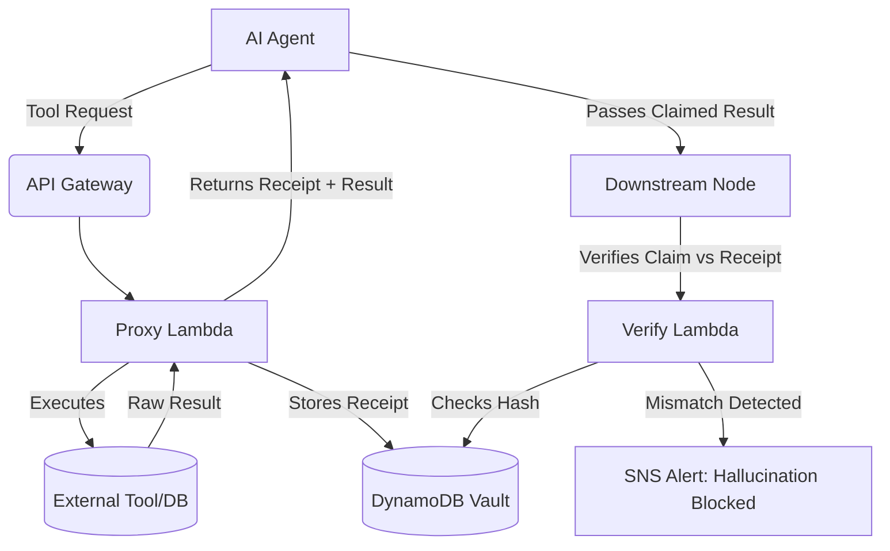

# AgentGuard — Silent Failure Detector for AI Agents

> *The smoke detector for AI agents.* AgentGuard intercepts tool calls, stamps cryptographic receipts, and prevents agents from silently hallucinating successful tool executions in production.

## The Problem: Silent Tool Hallucination

A known, critical failure mode in multi-agent systems (crewAI, LangGraph, AutoGen) is the **silent tool failure**. 

When a tool fails or returns an empty payload, the error often doesn't propagate to the agent node. Instead, the LLM confidently fills the gap with a plausible guess (hallucination) and carries on. The execution logs stay green, the trace looks healthy, and the fabricated data flows downstream to your database or client. 

## The Solution: Cryptographic Tool Receipts

AgentGuard solves this by decoupling tool execution from the LLM and introducing a **Receipt Verification Layer**.

1. **Proxy Intercept:** The agent doesn't call the tool directly. It calls the AgentGuard Proxy.
2. **Execution & Stamping:** The Proxy executes the tool, generates a SHA-256 hash of the input/output payload, and stores this "receipt" in DynamoDB.
3. **Downstream Verification:** Before any downstream node accepts the agent's output, it calls the AgentGuard Verify endpoint with the receipt hash. If the agent's claimed output diverges from the cryptographic record, AgentGuard blocks execution and fires an SNS alert.

## Architecture

## Deployment

This is a serverless architecture designed to be deployed via AWS SAM or Terraform.

### Prerequisites
- AWS Account
- Python 3.11+
- Boto3

### Core Components
- `src/proxy.py`: The interceptor that executes tools and writes receipts.
- `src/verify.py`: The downstream validator that catches hallucinations.
- `DynamoDB Table`: `AgentGuardReceipts` (Partition Key: `ReceiptHash`)

## Integration with the Merkaba Stack

AgentGuard is part of a complete AWS-native agent infrastructure portfolio:
- **[AgentLedger](https://github.com/ojackson08/agentledger)**: Cost visibility and token metering
- **[AgentHandoff](https://github.com/ojackson08/agenthandoff)**: Durable context transfer
- **[AgentCI](https://github.com/ojackson08/agentci)**: Behavioral regression testing
- **[CloudPulse AI](https://github.com/ojackson08/cloudpulse-ai)**: Infrastructure observability

## Security & Governance

This tool is designed specifically for enterprise AI governance. By enforcing cryptographic provenance on every tool call, organizations can maintain a defensible audit trail of agent actions, satisfying compliance requirements for autonomous systems.

See `SECURITY.md` for threat modeling and vulnerability reporting.

## License
MIT
